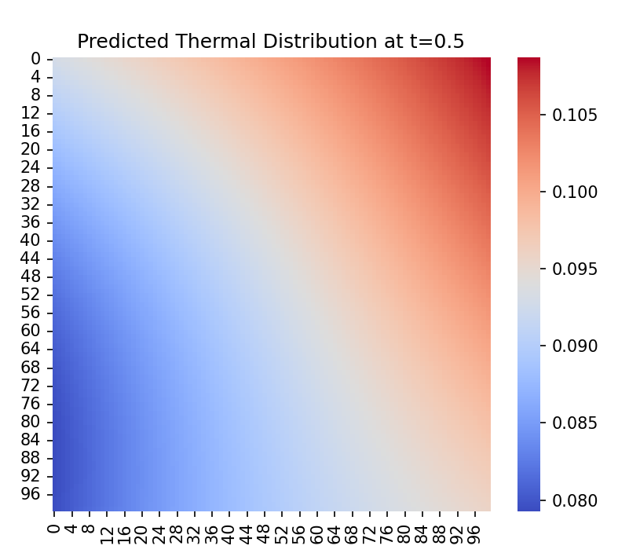

# Deep-Thermal-PINN: AI-Driven Thermal Management
> Fast and accurate thermal field prediction for electronic components using Physics-Informed Neural Networks (PINNs).

## 1. Project Overview
Thermal management is critical for the safety and efficiency of modern electronics, such as **EV Battery Packs** and **High-Performance CPU/GPUs**. Traditional Finite Element Analysis (FEA) is accurate but computationally expensive.

This project implements a **Physics-Informed Neural Network (PINN)** using PyTorch to solve the **2D Heat Diffusion Equation** directly. By embedding physical laws into the loss function, the model can predict temperature distribution without large labeled datasets.

## 2. Key Features
- **Physics-Driven:** Solves partial differential equations (PDEs) via automatic differentiation (`torch.autograd`).
- **Mesh-Free:** No complex mesh generation required, unlike traditional CFD/FEA.
- **Efficient:** Trained on a standard CPU within minutes.

## 3. Results
Here is the predicted thermal distribution at $t=0.5s$. The heat diffusion from the center source is clearly captured by the neural network.



## 4. Quick Start
### Dependencies
- Python 3.x
- PyTorch
- NumPy, Matplotlib, Seaborn

### How to Run
```bash
python main.py
